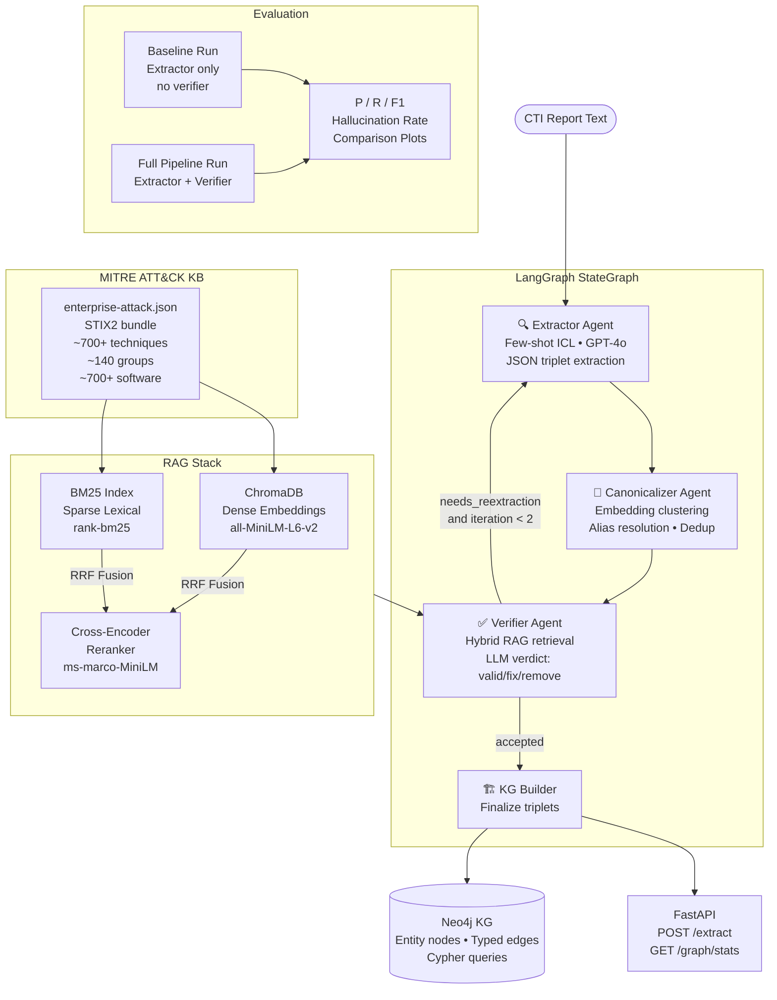
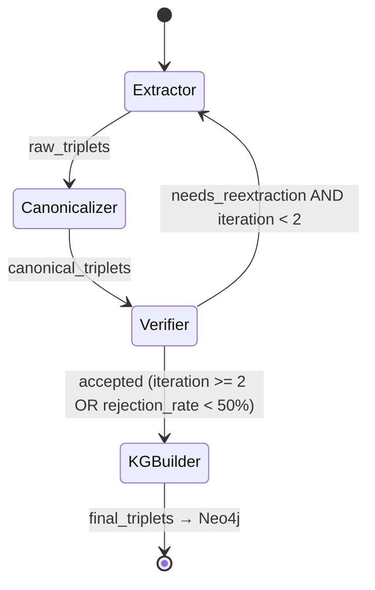

# Pipeline Architecture

## Full System Diagram



## Component Details

### Extractor Agent (Stage 2)

| Property | Value |
|---|---|
| LLM | GPT-4o (default) |
| Prompt style | System prompt + few-shot ICL (k=5 retrieved demos) |
| Demo retrieval | Cosine similarity over training report embeddings |
| Output format | JSON array of `{entity1, entity1_type, relation, entity2, entity2_type, confidence}` |
| Retry logic | 3 retries with exponential backoff on API errors |

### Canonicalizer (Stage 3)

| Property | Value |
|---|---|
| Clustering | Embedding cosine similarity, threshold 0.85 |
| Alias resolution | LLM selects canonical from each cluster |
| Deduplication | Hash-based on (entity1, relation, entity2) after lowercasing |

### Verifier Agent (Stage 4) — Core Contribution

| Property | Value |
|---|---|
| Retrieval strategy | Hybrid: BM25 + ChromaDB dense → RRF fusion → cross-encoder rerank |
| Context per triplet | Top-5 ATT&CK entries (techniques, groups, software) |
| LLM verdicts | `valid` / `corrected` / `hallucinated` |
| Feedback loop | If >50% rejected and iteration < 2 → re-extract |
| Knowledge base | MITRE ATT&CK Enterprise STIX2 (~1,500 entries indexed) |

### Knowledge Graph Schema (Neo4j)

```
(:Entity {name, type, normalized_name})
  types: Malware | ThreatActor | Tool | Vulnerability | Target | Technique | Tactic | Campaign | IOC

(:CTIReport {id, source, title})

(:Entity)-[:USES|:EXPLOITS|:TARGETS|:DROPS|...{relation, report_id, confidence}]->(:Entity)
(:CTIReport)-[:CONTAINS]->(:Entity)
```

## LangGraph State Transitions



## Evaluation Conditions

```
Condition A (Baseline):
  CTI Text → Extractor → Canonicalizer → [final triplets, NO verification]

Condition B (Full Pipeline):
  CTI Text → Extractor → Canonicalizer → Verifier ⟲ → [verified triplets]

Metrics:
  • Triplet Precision = TP / (TP + FP)
  • Triplet Recall    = TP / (TP + FN)  
  • Triplet F1        = 2·P·R / (P + R)
  • Hallucination Rate = |rejected| / |total_extracted|  [full pipeline only]

Ground truth: CTINexus dataset annotations (150 reports, MIT licensed)
```
