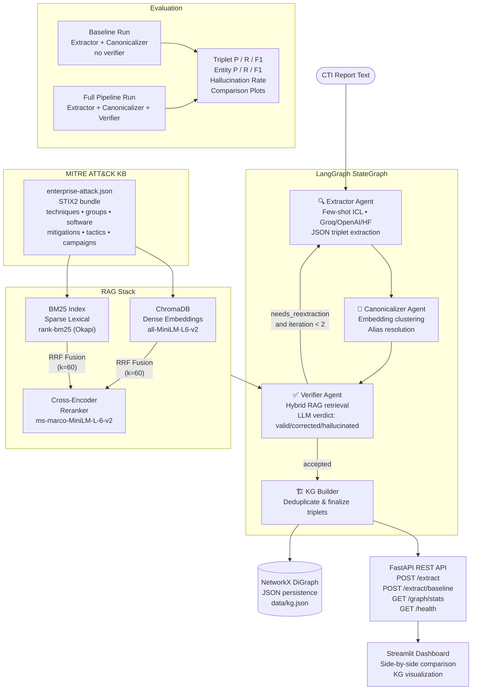
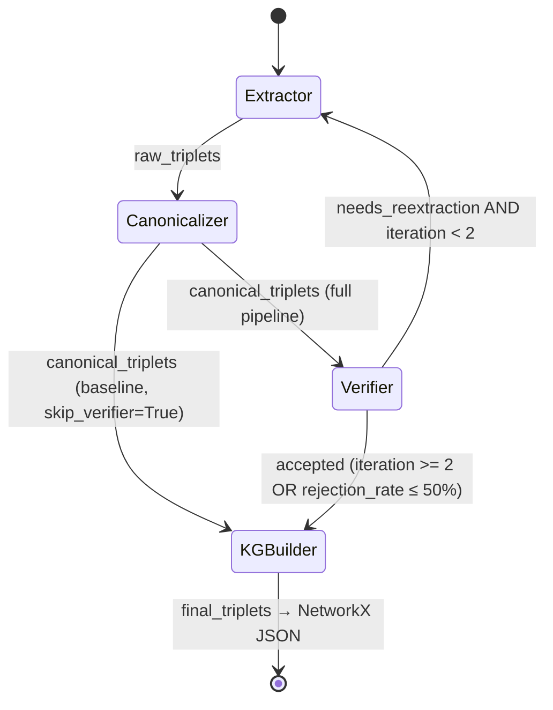
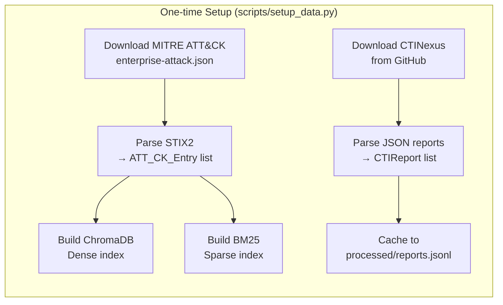

# Pipeline Architecture

## Full System Diagram



## Project Structure

```
verification-in-the-loop-cti-kg/
├── run_pipeline.py              # CLI entry point — runs pipeline on 3 test reports
├── streamlit_app.py             # Streamlit dashboard UI
├── pyproject.toml               # Project metadata & dependencies
│
├── src/
│   ├── agents/
│   │   ├── extractor.py         # Few-shot ICL triplet extraction agent
│   │   ├── canonicalizer.py     # Entity clustering & alias resolution agent
│   │   ├── verifier.py          # RAG-grounded verification agent
│   │   ├── llm_client.py        # Universal LLM caller (Groq/HF/OpenAI)
│   │   └── prompts/
│   │       ├── extractor_system.txt
│   │       ├── extractor_few_shot.txt
│   │       └── verifier_system.txt
│   │
│   ├── pipeline/
│   │   ├── graph.py             # LangGraph StateGraph wiring & conditional edges
│   │   └── runner.py            # PipelineConfig + PipelineRunner orchestration
│   │
│   ├── rag/
│   │   ├── vector_store.py      # ChromaDB dense vector store
│   │   ├── bm25_index.py        # BM25 sparse index (rank-bm25)
│   │   └── hybrid_retriever.py  # Hybrid retriever: BM25 + Dense + RRF + Cross-Encoder
│   │
│   ├── ingestion/
│   │   ├── models.py            # Pydantic models (Triplet, CTIReport, PipelineState, etc.)
│   │   ├── dataset_loader.py    # CTINexus download/parse + synthetic fallback
│   │   └── mitre_loader.py      # MITRE ATT&CK STIX2 downloader & parser
│   │
│   ├── kg/
│   │   └── networkx_writer.py   # NetworkX graph storage (JSON persistence)
│   │
│   ├── evaluation/
│   │   ├── evaluator.py         # P/R/F1 computation (triplet-level + entity-level)
│   │   ├── run_evaluation.py    # Typer CLI for running baseline/full evaluation
│   │   └── plot_results.py      # Matplotlib comparison plots
│   │
│   └── api/
│       ├── main.py              # FastAPI application (lifespan, endpoints)
│       └── schemas.py           # Pydantic request/response schemas
│
├── scripts/
│   ├── setup_data.py            # Download & build indexes
│   ├── test_pipeline.py         # Smoke test
│   ├── demo_query.py            # Demo query script
│   ├── re_evaluate.py           # Re-run evaluation from saved results
│   └── list_groq_models.py      # List available Groq models
│
├── data/                        # Runtime data (gitignored)
│   ├── mitre/                   # MITRE ATT&CK STIX bundle + BM25 index
│   ├── chroma/                  # ChromaDB persistent vector store
│   ├── ctinexus_raw/            # Downloaded CTINexus repo
│   ├── processed/               # Cached parsed reports (JSONL)
│   └── kg.json                  # NetworkX knowledge graph
│
└── results/                     # Pipeline output artifacts
    ├── extracted_triplets.json
    ├── verified_triplets.json
    ├── kg.json                  # Result-specific KG snapshot
    ├── kg_visualization.png
    ├── summary_report.md
    ├── figures/                  # Evaluation plots
    └── logs/                    # Per-report extraction logs
```

## Component Details

### LLM Client (`src/agents/llm_client.py`)

| Property | Value |
|---|---|
| Provider selection | `LLM_PROVIDER` env var: `groq` (default), `huggingface`, `openai` |
| Primary model | `PRIMARY_MODEL` env var (default: `llama-3.3-70b-versatile`) |
| Fallback model | `FALLBACK_MODEL` env var (default: `llama-3.1-8b-instant`) |
| Retry strategy | 4 attempts with jitter backoff `[0, 1, 2, 4]s`; each attempt tries primary then fallback |
| JSON recovery | Markdown fence stripping → preamble trimming → partial array recovery → LLM repair prompt |
| Observability | `@traceable` decorator via LangSmith |

### Extractor Agent (`src/agents/extractor.py`)

| Property | Value |
|---|---|
| LLM | Configured via `llm_client.py` (provider-agnostic) |
| Prompt style | System prompt (`extractor_system.txt`) + few-shot ICL template (`extractor_few_shot.txt`) |
| Demo retrieval | Cosine similarity over training report embeddings (SentenceTransformer) |
| Few-shot k | 5 (configurable), 6 triplets per demo (capped) |
| Report truncation | Max 2,500 chars (configurable via `max_report_chars`) |
| Output format | JSON array of `{entity1, entity1_type, relation, entity2, entity2_type, confidence}` |
| Entity type normalization | Fuzzy lookup table mapping ~70 variants → 10 canonical `EntityType` values |
| Re-extraction | On retry, appends verifier feedback to prompt for differentiated output |
| Logging | Per-report `.log` files + `pipeline_summary.log` in `results/logs/` |

### Canonicalizer Agent (`src/agents/canonicalizer.py`)

| Property | Value |
|---|---|
| Clustering | Single-linkage clustering by embedding cosine similarity (threshold: 0.85) |
| Alias resolution | LLM selects canonical name from each cluster; heuristic fallback (shortest proper noun) |
| Rewriting | Rewrites entity names in triplets using alias→canonical map |
| Deduplication | **None** — dedup happens downstream in KG Builder |

### Verifier Agent (`src/agents/verifier.py`) — Core Contribution

| Property | Value |
|---|---|
| Retrieval strategy | Hybrid: BM25 + ChromaDB dense → RRF fusion (k=60) → cross-encoder rerank |
| Fetch k | 20 candidates per retrieval method (configurable) |
| Context per triplet | Top-5 ATT&CK entries (techniques, groups, software, mitigations) |
| Query construction | `"{entity1} {relation} {entity2} {entity1_type} {entity2_type}"` |
| LLM verdicts | `valid` / `corrected` / `hallucinated` |
| Response parsing | JSON extraction with regex fallback for malformed/truncated responses |
| Feedback loop | If >50% rejected and iteration < 2 → re-extract with summarized feedback |
| Knowledge base | MITRE ATT&CK Enterprise STIX2 (techniques, groups, software, mitigations, tactics, campaigns) |

### KG Builder (in `src/pipeline/graph.py`)

| Property | Value |
|---|---|
| Source selection | Uses `verified_triplets` if verifier ran; otherwise `canonical_triplets` (baseline) |
| Deduplication | Hash-based on `(entity1.lower(), relation.lower(), entity2.lower())` |
| Output | `final_triplets` in PipelineState |

### Knowledge Graph Storage (`src/kg/networkx_writer.py`)

| Property | Value |
|---|---|
| Backend | **NetworkX DiGraph** (in-memory, no database server required) |
| Persistence | JSON node-link format (`data/kg.json` or `results/kg.json`) |
| Node schema | `{id: lowercased_name, label: EntityType, name: original_name}` |
| Edge schema | `{relation: str, confidence: float}` |
| Entity types | Malware, ThreatActor, Tool, Vulnerability, Target, Technique, Tactic, Campaign, IOC, Unknown |

### RAG Stack (`src/rag/`)

| Component | Implementation |
|---|---|
| Dense retrieval | ChromaDB PersistentClient, `all-MiniLM-L6-v2` embeddings, cosine similarity |
| Sparse retrieval | `rank-bm25` (BM25Okapi) with custom tokenizer |
| Fusion | Reciprocal Rank Fusion (k=60, Cormack et al. 2009) |
| Reranking | `cross-encoder/ms-marco-MiniLM-L-6-v2` (max_length=512) |
| Index persistence | ChromaDB: `data/chroma/`; BM25: `data/mitre/bm25_index.pkl` + `bm25_corpus.jsonl` |

## LangGraph State Transitions



### PipelineState (Mutable state dict)

```
PipelineState:
  report: CTIReport               # Input
  raw_triplets: list[Triplet]      # Extractor output
  canonical_triplets: list[Triplet]# Canonicalizer output
  verified_triplets: list[Triplet] # Verifier accepted (accumulated across iterations)
  revised_triplets: list[Triplet]  # Verifier corrected
  rejected_triplets: list[Triplet] # Verifier hallucinated
  verification_decisions: list[VerificationDecision]
  iteration: int                   # Current loop iteration (0-indexed)
  needs_reextraction: bool         # Router control flag
  reextraction_feedback: str       # Summarized feedback for retry prompt
  verifier_ran: bool               # Whether verifier was invoked
  final_triplets: list[Triplet]    # KG Builder output (deduplicated)
  error: Optional[str]
```

## FastAPI Endpoints (`src/api/main.py`)

| Method | Path | Description |
|---|---|---|
| `POST` | `/extract` | Full pipeline (Extractor → Canonicalizer → Verifier → KG write) |
| `POST` | `/extract/baseline` | Baseline (Extractor → Canonicalizer only, no verifier, no KG write) |
| `GET` | `/graph/stats` | NetworkX graph node/edge counts |
| `GET` | `/health` | Component health check (API, vector store, BM25, graph) |
| `GET` | `/` | Root endpoint with API metadata |

## Streamlit Dashboard (`streamlit_app.py`)

- Connects to FastAPI backend at `http://127.0.0.1:8000`
- Side-by-side comparison: Baseline vs. Verification Loop
- Verification summary metrics (valid/corrected/hallucinated counts)
- Interactive KG visualization (NetworkX + matplotlib)
- Verification audit log with per-triplet reasoning
- Hallucination breakdown charts (donut + bar)
- Entity-type color-coded badges

## Evaluation Conditions

```
Condition A (Baseline):
  CTI Text → Extractor → Canonicalizer → KG Builder → [final triplets, NO verification]

Condition B (Full Pipeline):
  CTI Text → Extractor → Canonicalizer → Verifier ⟲ → KG Builder → [verified triplets]

Triplet-Level Metrics:
  • Precision = TP / (TP + FP)
  • Recall    = TP / (TP + FN)
  • F1        = 2·P·R / (P + R)

Entity-Level Metrics:
  • Entity Precision = |pred_entities ∩ gt_entities| / |pred_entities|
  • Entity Recall    = |pred_entities ∩ gt_entities| / |gt_entities|
  • Entity F1        = 2·EP·ER / (EP + ER)

Hallucination Rate:
  • hallucination_rate = |rejected| / |total_extracted|  [full pipeline only]

Matching:
  • Triplet match: case-insensitive exact match on (entity1, relation, entity2)
  • Entity match: case-insensitive, punctuation-normalized

Ground truth: CTINexus dataset (peng-gao-lab/CTINexus, MIT licensed)
  Falls back to synthetic demo data (5 templates × N reports) if CTINexus unavailable

CLI: python -m src.evaluation.run_evaluation --subset 20 --condition both
```

## Data Pipeline


